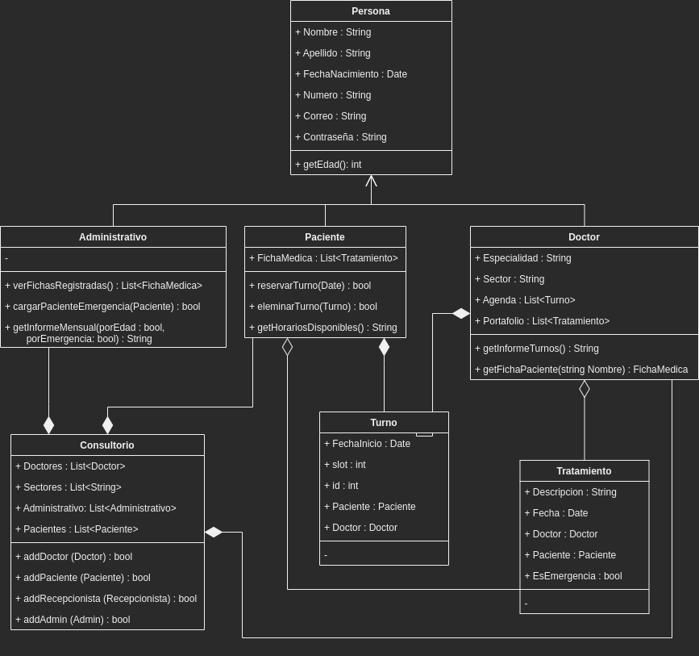

# Proyecto para curso 1000 Programadores Salteños

En este repositorio se encuentra todo el proyecto java, diagrama de clase, DER y script SQL para la creación de la base de datos en MySQL.

## Diagrama de Clases

## Diagrama Entidad-Relacion

## Sobre el proyecto

Es un sistema de gestión de turnos y tratamientos de un consultorio odontológico llamado "Dr. Muelas".

Funciones del sistema:
 - Como Paciente:
 	+ Reservar un turno (funcionando)
 	+ Eliminar un turno (funcionando)
 	+ Ver ficha de tratamientos en el consultorio (funcionando)
 - Como Doctor:
 	+ Cargar un tratamiento de un paciente (funcionando)
 	+ Ver ficha de un paciente (funcionando)
 	+ Ver agenda del día (no programada)
 - Como Administrativo:
 	+ Ver ficha de un paciente (funcionando)
 	+ Ver informe de pacientes atendidos (no programada)
 	+ Cargar paciente en emergencia (no programada)
 	
 ## Libreria usada en el proyecto

 - [Java ASCII Render](https://github.com/indvd00m/java-ascii-render): utilizada para hacer la interfaz de usuario bonita.
